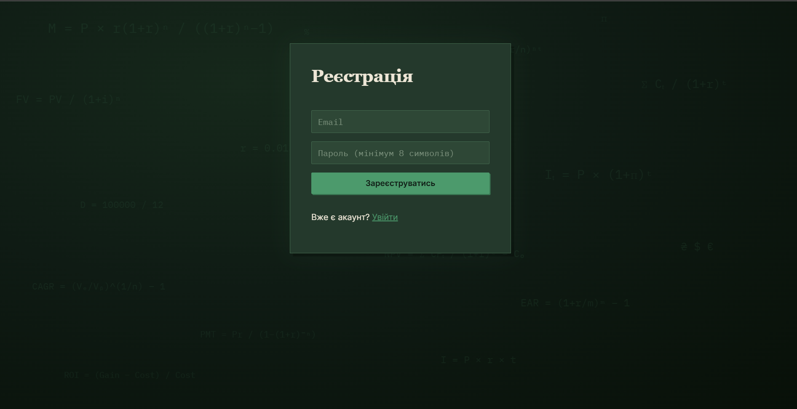
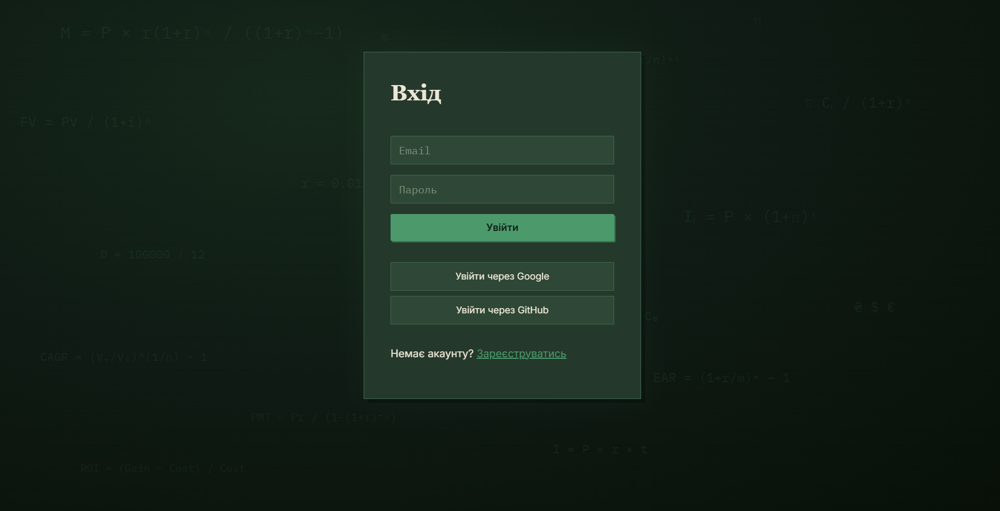
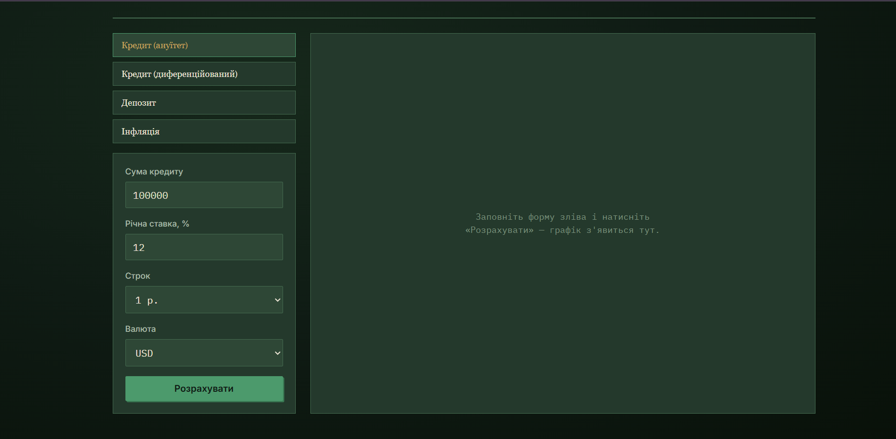
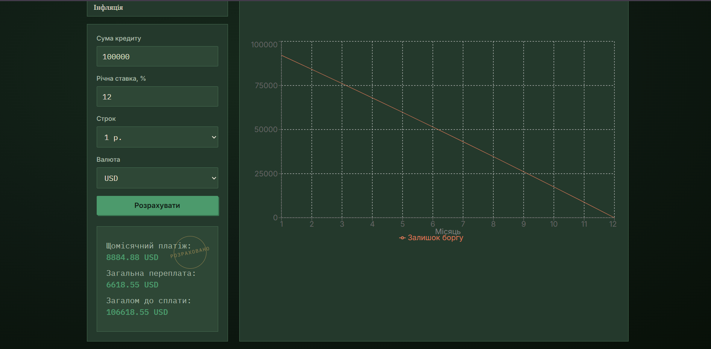
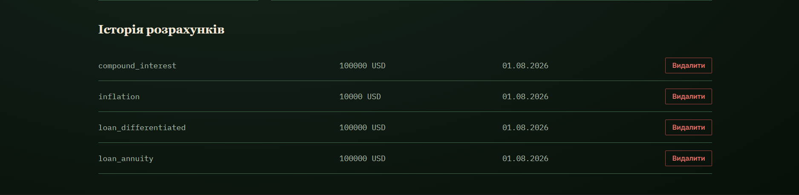

# 💰 Finance Calculator

Навчальний повнофункціональний веб-застосунок для фінансових розрахунків: кредити (ануїтет і диференційований платіж), депозити (складний відсоток), інфляція купівельної спроможності — з авторизацією через email та OAuth (Google, GitHub), історією розрахунків і живими курсами валют.


---

## 📖 Зміст

- [Скріншоти](#-скріншоти)
- [Про проєкт](#-про-проєкт)
- [Функціонал](#-функціонал)
- [Технологічний стек](#-технологічний-стек)
- [Архітектура](#-архітектура)
- [Структура проєкту](#-структура-проєкту)
- [Встановлення та запуск](#-встановлення-та-запуск)
- [Налаштування зовнішніх сервісів](#-налаштування-зовнішніх-сервісів)
- [API документація](#-api-документація)
- [Тестування](#-тестування)
- [Безпека](#-безпека)
- [Git-флоу проєкту](#-git-флоу-проєкту)
- [Плани на майбутнє](#-плани-на-майбутнє)

---

## 📌 Про проєкт

**Finance Calculator** — навчальний pet-проєкт, створений з метою опанувати повний цикл розробки сучасного веб-застосунку: від проєктування архітектури бекенду на FastAPI до розгортання через Docker Compose і покриття тестами.

Застосунок дозволяє користувачам:
- Розраховувати щомісячні платежі за кредитом (ануїтетна та диференційована схема)
- Розраховувати прибутковість депозиту зі складним відсотком
- Оцінювати вплив інфляції на купівельну спроможність грошей
- Зберігати історію своїх розрахунків
- Переглядати актуальні курси валют

---

## 📸 Скріншоти

### Реєстрація


### Вхід


### Дашборд з історією розрахунків


### Калькулятор з результатом розрахунку


### Історія розрахунків


## ✨ Функціонал

### Авторизація
- Реєстрація через email + пароль з підтвердженням пошти (лист з посиланням)
- Вхід через Google OAuth2
- Вхід через GitHub OAuth2
- JWT-авторизація: короткоживучий access token + refresh token з ротацією
- Механізм відкликання токенів (logout з одного пристрою / з усіх пристроїв)
- Rate limiting на чутливих ендпоінтах (реєстрація, логін, оновлення токена)

### Фінансові калькулятори
| Калькулятор | Опис |
|---|---|
| **Кредит (ануїтет)** | Фіксований щомісячний платіж на весь строк |
| **Кредит (диференційований)** | Платіж зменшується щомісяця, менша загальна переплата |
| **Депозит (складний відсоток)** | Капіталізація щомісячна / щоквартальна / щорічна |
| **Інфляція** | Знецінення купівельної спроможності суми за N років |

Кожен розрахунок повертає деталізований графік по періодах (для побудови інтерактивного графіка на фронтенді) і автоматично зберігається в історію користувача.

### Курси валют
- Інтеграція з ExchangeRate-API (безкоштовний зовнішній сервіс)
- Кешування курсів у Redis з TTL
- Фонове автоматичне оновлення курсів через плановане завдання (APScheduler), незалежно від активності користувачів
- Стійкість до збоїв: якщо зовнішній API тимчасово недоступний, віддається останній відомий кеш замість помилки

### Історія розрахунків
- Перегляд усіх попередніх розрахунків користувача
- Фільтрація за типом розрахунку
- Пагінація
- Видалення власних записів (з перевіркою належності запису користувачу)

### Візуальний стиль
Інтерфейс оформлений у темній зелено-паперовій "ledger"-естетиці (стилізація під банківську облікову книгу):
- Табличні моноширинні цифри (IBM Plex Mono) для всіх сум і форм
- Заголовки шрифтом Newsreader
- Кругла позначка-"штамп" `РОЗРАХОВАНО` на панелі результату
- Анімований фон (`MathBackground.jsx`) із плаваючими фінансовими формулами (ануїтет, складний відсоток, NPV, CAGR, EAR тощо), що повільно рухаються та обертаються на задньому плані

---

## 🛠 Технологічний стек

**Backend**
- Python 3.12, FastAPI (async), Uvicorn
- SQLAlchemy 2.0 (async ORM), Alembic (міграції)
- PostgreSQL 16, Redis 7
- JWT (python-jose), passlib + bcrypt
- Authlib / httpx — OAuth2-флоу (Google, GitHub)
- APScheduler — фонові задачі
- aiosmtplib + Jinja2 — відправка листів верифікації
- slowapi — rate limiting
- pytest, pytest-asyncio, respx — тестування (unit / integration / mocks)

**Frontend**
- React 18, React Router
- Axios (з автоматичним оновленням токена через interceptor)
- Recharts — інтерактивні графіки
- Vite — dev-сервер і білд

**Інфраструктура**
- Docker + Docker Compose (5 сервісів: backend, frontend, postgres, redis, nginx)
- Nginx — реверс-проксі, єдина точка входу
- Git flow: `main` → `develop` → `feature/*`

---

## 🏗 Архітектура

Бекенд побудований за шаруватою архітектурою з чітким розділенням відповідальності:

```
HTTP-запит
    │
    ▼
api/v1/*.py          — тонкий HTTP-шар: приймає запит, викликає сервіс, повертає відповідь
    │
    ▼
services/*.py         — бізнес-логіка: правила, координація, оркестрація
    │
    ├──▶ core/calculators/*.py   — чиста математика (без БД, без HTTP)
    ├──▶ core/security.py        — JWT, хешування паролів
    └──▶ repositories/*.py       — доступ до БД (CRUD, без бізнес-логіки)
              │
              ▼
         PostgreSQL / Redis
```

Кожен клас-калькулятор (`AnnuityLoanCalculator`, `DifferentiatedLoanCalculator`, `CompoundInterestCalculator`, `InflationCalculator`) успадковує спільний абстрактний `BaseCalculator` і реалізує єдиний метод `.calculate()` — це дозволяє легко додавати нові види розрахунків без зміни решти системи.

### Автоматичні міграції при старті

Контейнер `backend` використовує власний `entrypoint.sh` замість прямого запуску `uvicorn`:

```sh
#!/bin/sh
set -e
echo "Running Alembic migrations..."
alembic upgrade head
echo "Starting server..."
exec uvicorn app.main:app --host 0.0.0.0 --port 8000 --reload
```

Це гарантує, що схема бази даних завжди синхронізована з поточною версією моделей ще до того, як застосунок почне приймати запити — не потрібно пам'ятати про ручний виклик міграцій після `docker-compose up`.

### Авторизація і токени

- **Access token** (JWT, 15 хв) — stateless, самодостатній, не зберігається в БД
- **Refresh token** (випадковий рядок, 7 днів) — зберігається в БД **у вигляді хешу** (SHA-256), що дозволяє відкликати конкретну сесію в будь-який момент
- При кожному оновленні access token відбувається **ротація** refresh token: старий одразу відкликається, видається новий. Повторне використання вже "спаленого" токена трактується як ознака компрометації — усі токени користувача відкликаються превентивно

---

## 📂 Структура проєкту

```
finance-calc/
├── docker-compose.yml
├── .env.example
├── nginx/
│   └── nginx.conf
├── backend/
│   ├── Dockerfile
│   ├── entrypoint.sh                # автозапуск міграцій перед стартом сервера
│   ├── requirements.txt
│   ├── alembic.ini
│   ├── pytest.ini
│   ├── app/
│   │   ├── main.py                  # точка входу FastAPI
│   │   ├── config.py                # налаштування (.env)
│   │   ├── database.py              # async SQLAlchemy engine
│   │   ├── dependencies.py          # get_current_user та інші залежності
│   │   ├── models/                  # ORM-моделі (User, RefreshToken, Calculation)
│   │   ├── schemas/                 # Pydantic-схеми
│   │   ├── core/
│   │   │   ├── security.py          # JWT, хешування
│   │   │   ├── limiter.py           # rate limiting
│   │   │   └── calculators/         # фінансова математика
│   │   ├── services/                # бізнес-логіка
│   │   ├── repositories/            # доступ до БД
│   │   ├── api/v1/                  # роутери
│   │   └── utils/                   # Redis-клієнт, планувальник
│   ├── migrations/                  # Alembic
│   └── tests/                       # unit / integration / mocks
└── frontend/
    ├── index.html
    ├── vite.config.js
    └── src/
        ├── main.jsx
        ├── App.jsx
        ├── styles.css                # темна зелена тема, ledger-дизайн
        ├── api/                       # axios-клієнти (auth, calculator, currency)
        ├── context/                   # AuthContext
        ├── pages/                     # Login, Register, Dashboard, Calculator, OAuthSuccess...
        └── components/
            ├── MathBackground.jsx     # анімований фон з фінансовими формулами
            ├── calculators/           # LoanForm, DepositForm, InflationForm, ResultChart
            └── ui/                    # Button, CurrencySelect, TermSelect
```

---

## 🚀 Встановлення та запуск

### Передумови
- Docker та Docker Compose
- Git

### Кроки

```bash
# 1. Клонувати репозиторій
git clone <URL_репозиторію>
cd finance-calc

# 2. Скопіювати шаблон конфігурації
cp .env.example .env

# 3. Заповнити .env реальними значеннями
#    (див. розділ "Налаштування зовнішніх сервісів" нижче)

# 4. Підняти всі контейнери
docker-compose up --build -d

# 5. Створити тестову базу даних (окрема БД, потрібна лише для прогону тестів)
docker-compose exec postgres psql -U finance_user -d finance_calc -c "CREATE DATABASE finance_calc_test;"
```

Міграції БД застосовуються **автоматично**: контейнер `backend` при кожному старті сам виконує `alembic upgrade head` через `entrypoint.sh`, перш ніж підняти сервер — вручну запускати `alembic upgrade` не потрібно.

Якщо ж змінилися моделі (`app/models/*.py`) і потрібна **нова** міграція — згенерувати її потрібно вручну:

```bash
docker-compose exec backend alembic revision --autogenerate -m "Опис зміни"
```

Нова міграція збережеться у `backend/migrations/versions/` і застосується автоматично при наступному старті контейнера (або одразу командою `docker-compose exec backend alembic upgrade head`).

### Доступ до застосунку

| Сервіс | URL |
|---|---|
| Фронтенд (напряму) | http://localhost:3000 |
| Фронтенд (через nginx) | http://localhost |
| Backend API | http://localhost:8000 |
| Swagger-документація | http://localhost:8000/docs |
| Health check | http://localhost:8000/health |

---

## 🔑 Налаштування зовнішніх сервісів

Проєкт залежить від кількох безкоштовних зовнішніх сервісів. Усі змінні прописуються в `.env`.

### JWT Secret Key
```bash
python -c "import secrets; print(secrets.token_hex(32))"
```

### Gmail SMTP (відправка листів верифікації)
1. Увімкнути двоетапну перевірку: https://myaccount.google.com/security
2. Створити App Password: https://myaccount.google.com/apppasswords
3. Вписати в `.env`:
   ```
   SMTP_USER=your_email@gmail.com
   SMTP_PASSWORD=<16-символьний App Password без пробілів>
   ```

### ExchangeRate-API (курси валют)
1. Безкоштовна реєстрація: https://www.exchangerate-api.com/
2. Скопіювати API-ключ у `.env`:
   ```
   EXCHANGE_RATE_API_KEY=<ваш ключ>
   ```

### Google OAuth
1. Google Cloud Console → створити проєкт → OAuth consent screen → Credentials → Create OAuth client ID
2. Тип застосунку: Web application
3. Authorized redirect URI: `http://localhost:8000/api/v1/oauth/google/callback`
4. Вписати `GOOGLE_CLIENT_ID` та `GOOGLE_CLIENT_SECRET` у `.env`

### GitHub OAuth
1. https://github.com/settings/developers → New OAuth App
2. Authorization callback URL: `http://localhost:8000/api/v1/oauth/github/callback`
3. Вписати `GITHUB_CLIENT_ID` та `GITHUB_CLIENT_SECRET` у `.env`

---

## 📘 API документація

Повна інтерактивна документація доступна за адресою **`/docs`** (Swagger UI) після запуску бекенду.

### Основні групи ендпоінтів

| Група | Префікс | Опис |
|---|---|---|
| Auth | `/api/v1/auth/*` | Реєстрація, логін, верифікація email, refresh, logout |
| OAuth | `/api/v1/oauth/*` | Вхід через Google / GitHub |
| Calculators | `/api/v1/calculate/*` | Кредит, депозит, інфляція, історія |
| Currency | `/api/v1/currency/*` | Курси валют, конвертація |

---

## 🧪 Тестування

Проєкт має 89 тестів, що охоплюють три рівні:

- **Unit-тести** (`tests/unit/`) — ізольована перевірка калькуляторів і криптографічних функцій, без БД і мережі
- **Integration-тести** (`tests/integration/`) — повний HTTP-стек (роутер → сервіс → тестова БД) через `httpx.AsyncClient`
- **Mock-тести** (`tests/mocks/`) — зовнішні залежності (ExchangeRate-API, SMTP) підмінені через `respx` / `unittest.mock`, без реальних мережевих викликів

```bash
docker-compose exec backend pytest -v
```

---

## 🔒 Безпека

- Паролі хешуються через bcrypt (passlib), ніколи не зберігаються у відкритому вигляді
- Refresh-токени зберігаються в БД у вигляді SHA-256 хешу, а не в чистому тексті
- Захист від CSRF в OAuth-флоу через одноразовий `state`-параметр з коротким TTL у Redis
- Rate limiting на `/auth/register`, `/auth/login`, `/auth/refresh`, `/currency/refresh`
- Захист від user enumeration: однакові відповіді незалежно від того, чи існує вказаний email
- Перевірка належності ресурсу користувачу на рівні SQL-запиту (не можна видалити чужий розрахунок)
- CORS обмежений конкретним origin фронтенду

---

## 🌿 Git-флоу проєкту

```
main        — стабільна, готова до використання версія
  ↑
develop     — інтеграційна гілка для перевірки перед релізом
  ↑
feature/*   — розробка окремих функцій
```

---


## 📄 Ліцензія

Навчальний проєкт, створений з освітньою метою.